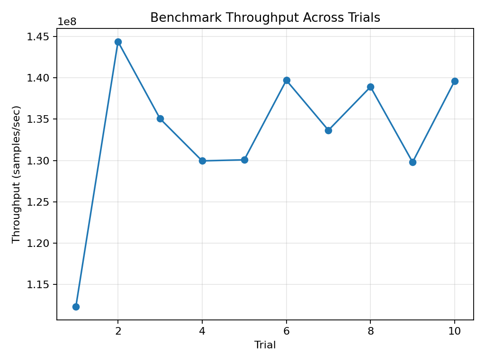

# High-Performance Systems & Algorithms Bench (C++ / Python)

Benchmarking and experimentation suite focused on
performance-critical systems programming, numerical algorithms, and
engineering discipline.

The project combines a modern C++ simulation kernel with a Python-based
experiment runner to support repeatable benchmarking, correctness checks,
and performance analysis on Linux and Windows.

---

## Key Features

- **Performance-critical C++ kernel**
  - Monte Carlo simulation with deterministic execution
  - Emphasis on efficient loops, data locality, and reproducibility
- **Cross-platform build system**
  - CMake-based configuration
  - MSVC (Windows) and GCC/Clang (Linux) support
- **Correctness validation**
  - Unit tests validating statistical properties and numerical sanity
- **Repeatable experiments**
  - Python runner for multi-trial benchmarks and summary statistics
- **Profiling workflow**
  - Linux profiling support (`perf`, `valgrind/callgrind`)
  - Clear separation of benchmarking and analysis logic

---

## Benchmark Visualization

The figure below shows benchmark throughput measured across multiple
independent trials of the same simulation workload.

Each trial executes the same Monte Carlo kernel with identical parameters,
allowing evaluation of run-to-run stability and steady-state performance.



### Interpretation

- Throughput stabilizes after initial warm-up, indicating a compute-bound
  kernel with predictable performance characteristics.
- Minor variability between trials is expected due to OS scheduling,
  CPU frequency scaling, and cache effects.
- The absence of large spikes or drift demonstrates deterministic behavior
  and reproducible performance under repeated execution.

This visualization highlights why multi-trial benchmarking is essential
for performance-sensitive simulation and EDA-style workloads, where
steady-state behavior is more informative than single-run timings.
---

## Build Instructions

### Linux / macOS (GCC or Clang)

```bash
cmake -S . -B build -DCMAKE_BUILD_TYPE=Release
cmake --build build -j
ctest --test-dir build --output-on-failure
````

Run the benchmark:

```bash
./build/bench --samples 2000000 --seed 123
```

---

### Windows (MSVC + Ninja)

Open **“x64 Native Tools Command Prompt”** and run:

```bat
cmake -S . -B build -G Ninja -DCMAKE_BUILD_TYPE=Release
cmake --build build
ctest --test-dir build --output-on-failure
python python\run_bench.py --trials 5 --samples 2000000
```

---

## Python Benchmark Runner

The Python runner executes multiple benchmark trials and aggregates results
(mean, standard deviation, throughput):

```bash
python python/run_bench.py --trials 5 --samples 2000000
```

This enables:

* Stable performance comparisons
* Noise reduction across runs
* Clear reporting for experimentation and tuning

---

## Example Output

```
samples=2000000 pi=3.14206 seconds=0.0170 throughput=1.17e+08 samples/sec

Summary
seconds: mean=0.0188 stdev=0.0022
throughput: mean=1.08e+08 samples/sec
```

---